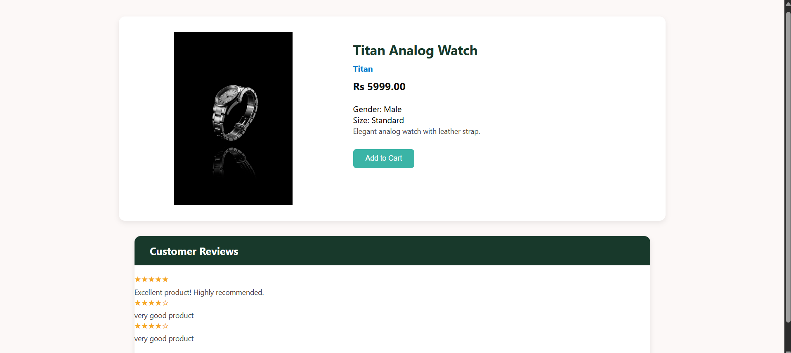

# Celeste – Luxury Retail Management System

Celeste is a comprehensive **Luxury Retail Management System** designed to manage the backend operations of a retail business selling **Watches, Bags, and Sunglasses**.
Built using **MySQL** for robust data handling and efficient querying, this system ensures seamless **inventory, customer, admin and sales management**.

---

## Website Previews
Landing page                        
  

Homepage                         
  

Product Page                             
 

> *These images show parts of the Celeste interface: main storefront, detailed product listings, and the administrative panel.*

---

##  Features

* **Customer and Admin Login System**
* **Multi-category product browsing (Watches, Bags, Sunglasses)**
* **Multi-category filtering (Price, Gender, Colour)**
* **Live Order placement and tracking**
* **Inventory tracking and automated restocking triggers**
* **Membership an discount system**
* **Sales and inventory analytics (daily, monthly)**
* **Multi-store and employee management**
---

## Technologies Used

* **Frontend:** HTML, CSS, JavaScript
* **Backend:** Flask (or PHP/Node if applicable), Python
* **Database:** MySQL
* **Tools:** Figma, Canva, Lucidchart
* **AI Support:** Utilized ChatGPT LLM to refine queries and normalization logic

---

## Database Concepts Used

* Entity-Relationship (ER) Modeling
* Relational Schema Mapping
* SQL Table Creation, Data Insertion, and Joins
* Use of **Triggers** for stock management, membership updates, and order validation
* Use of **Views** for data abstraction and reporting
* **Normalization** up to **Third Normal Form (3NF)** to ensure data consistency and eliminate redundancy
* Implementation of **Foreign Key Constraints** and **Indexing** for relational integrity and performance optimization

---
## Tables and Data

* Created and populated over **10 relational tables** using SQL scripts
* Populated `Customer`, `Product`, `Supplier`, `Order`, and `Review` tables with realistic and diverse data
* Defined **Primary Keys**, **Foreign Keys**, **Auto-Increment**, and **Data Types** per business needs
* Applied **CHECK constraints**, **NOT NULLs**, and **DEFAULTs** where applicable

---

## Future Enhancements

* Add full-fledged **REST API** support
* Integrate **payment gateways** for checkout
* Add **AI-powered product recommendations**

---

## Contributors

* Aarushi Verma, Aditi Aryan, Bhuvika Mehta, Varsha Ganesh
---
